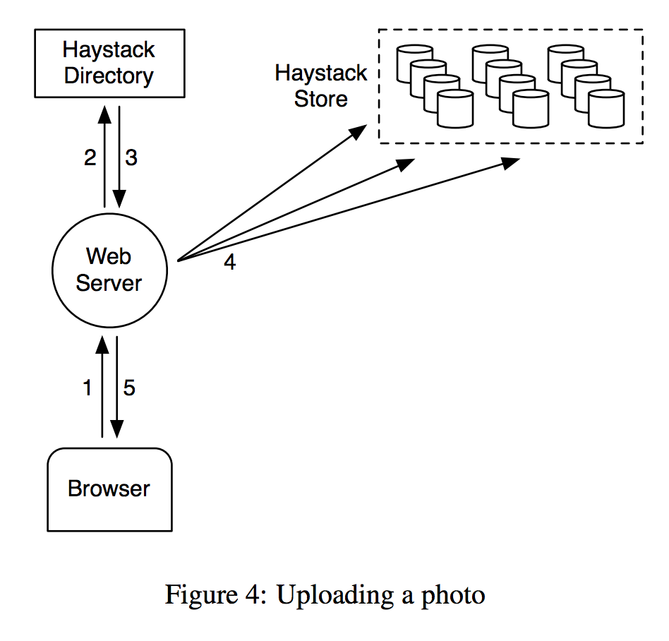

# Facebook Haystack Implementation

## Specs
URL: `http://<Cache>/<Machine id>/<Logical volume, Photo>`

### Read


### Write


## Getting Started
Be sure to install Docker 1.12.1 on the machine that runs this system

```
sh run.sh
```

After everything is up and running, you should be able to see the 'dynamic' webpage via visiting `localhost` or `0.0.0.0` on your browser.

### Stop Containers

```
make stop
```

### Re-start Containers
After setting up via `run.sh`, you can stop these containers and start them again later. However, be aware that improper launching order might crash the system, because `h_directory` container needs some time to set up. The recommended re-launching order is as below

```
docker start h_directory
sleep 5
docker start h_cache
docker start h_nginx
docker start h_webfront
```

For your convenience, you can just

```
make resume
```

### Remove Containers
To remove all involved containers, and to delete all dangling Docker volumes

```
make clean
```

### Run Containers Manually
If you want to initialize the containers manually, such as

```
docker run -itd --name dummy dummy_image
```
there are some tricky issues. The fact is that setting up the Cassandra server in `h_directory` could take some time. If you run `h_webfront` immediately after `h_directory`, the Node.js server in `h_webfront` could fail because it cannot connect to the Cassandra server right away. Also, you must make sure that the target keyspace, such as `photo`, exists in the Cassandra server before you launch the Node.js server.

[Live Demo](http://playground.hyoung.me/)

## Description
### Conceptual Workflow
1. when a client visits the website, the request first hits the reverse proxy server
2. the reverse proxy server sends the request to one front-end web server
3. the web server constructs a customized webpage based on the client information (in our case, we just present three random photos)
	1. the web server prepare photo ids
	2. the web server asks the Cassandra server for photo information with corresponding photo ids
	3. the web server constructs photo URLs based on the replies from the Cassandra server
	4. the web server embeds photo URLs in the webpage
4. the web server returns the dynamically generated webpage to the client via the reverse proxy server
5. the client's browser asks the Cache server for the photos
6. the client sees the customized webpage with photos


### Components Description
All components are set up in a subset `172.20.0.0\16`. Only the reverse proxy server and the Cache server are exposed to the public.

TODO priority is indicated by the number of ★

#### Reverse Proxy Server - Nginx
Responsibilities

* server as front-end web servers gateway
* load-balance client requests among front-end web servers

**TODOs**

* ★ add requests load-balancing feature among at least two front-end web servers

#### Front-end Web Server - Node.js
Responsibilities

* dynamically generate webpage (mainly photos) based on client information
	* in the prototype, just generate a webpage with three random images links
* contact the Directory (Cassandra server) for specific photo information with photo ids
* construct photo URLs and embed them into the webpage
* return the webpage to the client

**TODOs**

* ★★★ redesign the photo URL template that contains information about
	* Cache server ip address
	* Store machine id
	* logical volume id
	* photo id
* ★★ add photo upload feature
	* assign a photo id to the uploaded photo
	* send photo id to the Directory and ask for writable Store machines information
	* store the uploaded photo in writable Stores
* ★ add photo delete feature
* ★ deploy at least two servers to demonstarte the capability of scaling


#### Haystack Directory - Cassandra
Responsibilities

* maintain the photo information in database
	* in the prototype, there is a simple table `photo` in keyspace `photo` with schema

		```
		(pid INT PRIMARY KEY, pindex VARSTR)
		```
* accept query for photo information

**TODOs**

* ★★★ redesign photo table schema such as

		(pid INT PRIMARY KEY, logical_volume_id INT)
* ★★ design a Store machine mapping table schema such as

		(logical_volume_id INT PRIMARY KEY, Store_machine_id INT)
* ★★ design a Store machine status table schema such as

		(Store_machine_id INT PRIMARY KEY, writable_flag INT)
* ★ accept query for writable Store machine


#### Haystack Cache - Redis & Node.js
Responsibilities

* return requested photos

**TODOs**

* ★★ change the photo fetch (from Store) interface after the new-designed file system is up


#### Haystack Store - Docker Data Volume
Responsibilities

* provide quick photo read based on photo id


**TODOs**

* ★★★ design a file system that could read/write photo quickly
	* design metadata
	* design file needle
	* design file read/write operation by filename, offset, and size
